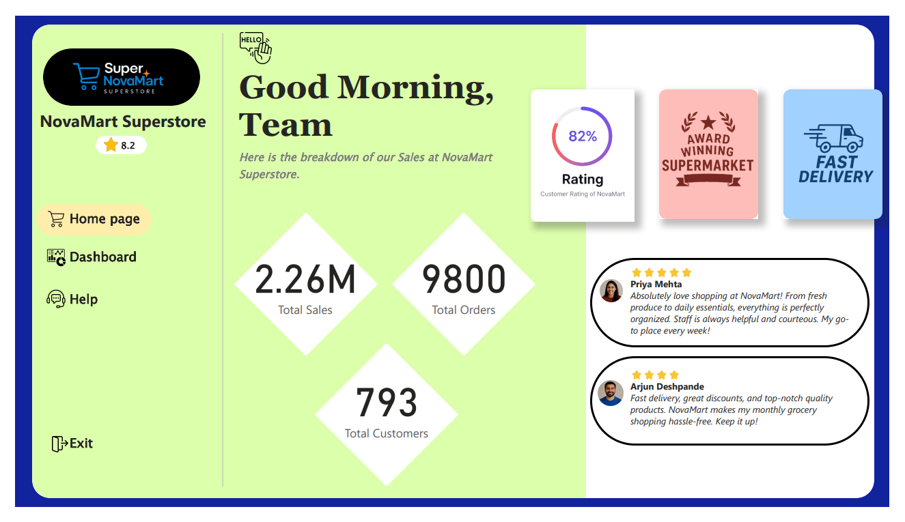
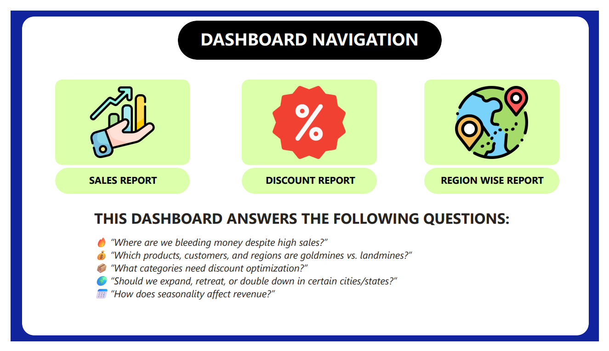
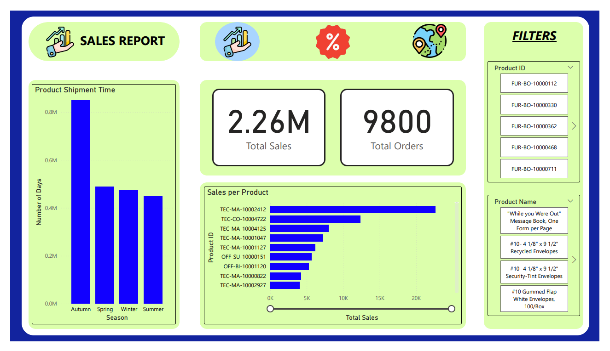
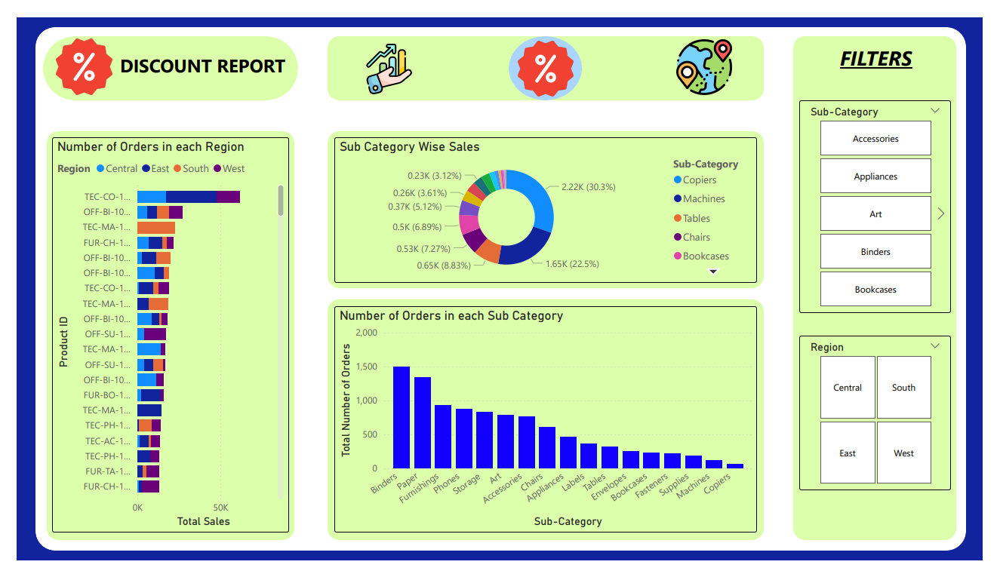
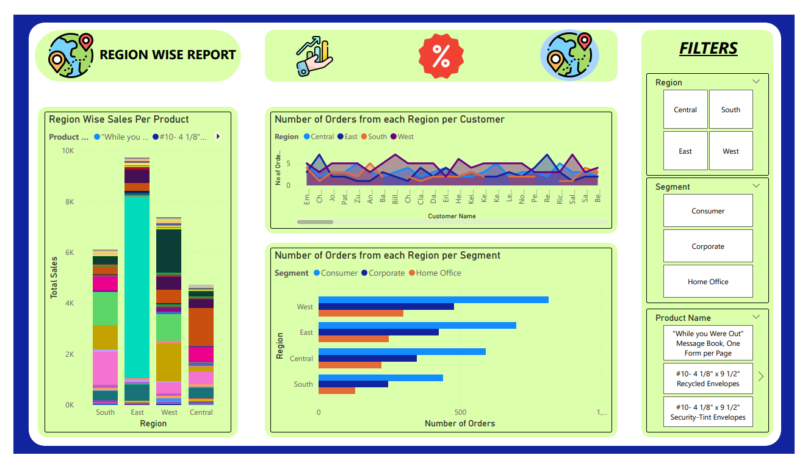

# 📊 NovaMart Superstore Sales Dashboard

**"The Superstore That Couldn’t Scale" — A Data Analyst’s Dive into Hidden Profit Leaks**

Welcome to the Power BI Dashboard that uncovers how a booming superstore was **silently bleeding profits** despite increasing sales. In this project, we play the role of a data detective — cutting through noise, cracking patterns, and delivering **actionable insights**.

---

## 🧠 THE DATA STORY

Once upon a spreadsheet, NovaMart was thriving with booming orders and happy customers. Yet, something wasn’t right — **profits were vanishing**. That’s when the data analyst (you) stepped in...

🔍 You didn’t just build charts —  
You solved a **business mystery**.

---

## 🎯 OBJECTIVES

Your mission was clear:
- 🔥 Find where we are bleeding money despite high sales
- 💰 Identify products and regions that are goldmines vs. landmines
- 📦 Optimize discount strategies across categories
- 🌍 Help the business decide where to expand, retreat, or double down
- 📅 Analyze seasonal trends and shipping impacts

---

## 📌 DASHBOARD SECTIONS

| Section | Description |
|--------|-------------|
| **Sales Report** | Visualizes product-wise sales, shipment times, and seasonal order trends |
| **Discount Report** | Shows sub-category sales & discounts, scatter plots of profit vs. discount |
| **Region-Wise Report** | Highlights regional performance, segment-wise breakdown, and customer-level insights |

---

## 💡 KEY INSIGHTS

| Focus | Description |
|-------|-------------|
| 📉 **Sales vs. Profit** | Some sub-categories show high sales but negative or low profit margins |
| 🏙️ **Top/Bottom Regions** | Certain regions are consistently underperforming in profit-to-sales ratio |
| 💸 **Discount Impact** | Discounts hurt profit in categories like Chairs & Tables — need tighter control |
| 📦 **Product Drivers** | Copiers & Binders emerge as high-profit product lines |
| 👥 **Customer Segments** | Home Office customers show high order value but low repeat rates |
| 📅 **Seasonality** | Winter sales spike, but profit dips hint at aggressive discounting |
| 🚚 **Shipping Analysis** | Standard class is overused — increasing cost without visible profit boost |

---

## 🛠 TOOLS USED

- **Power BI Desktop**
- **CSV Sales Dataset** (Kaggle - [Sales Forecasting Dataset](https://www.kaggle.com/datasets/rohitsahoo/sales-forecasting))
- Data Cleaning & Modeling in Power BI

---

## 📸 DASHBOARD PREVIEW

  

  

  

  

  

---

## 📁 Files Included

- `Sales Analysis.pdf`: Dashboard walk-through
- `train.csv`: Dataset used for the report
- `Sales_Analysis.pbix`: Power BI dashboard file (if included)
- `README.md`: This documentation

---

## 🙌 Feedback or Collaboration?

Feel free to connect and collaborate!  
📩 **LinkedIn**: [Pragyan Dhar](https://www.linkedin.com/in/pragyan-dhar-b98696313/)  
🐙 **GitHub**: [pragyandhar](https://github.com/pragyandhar)

---

> Built with 🧠 strategy, 📈 insight, and 💙 data
